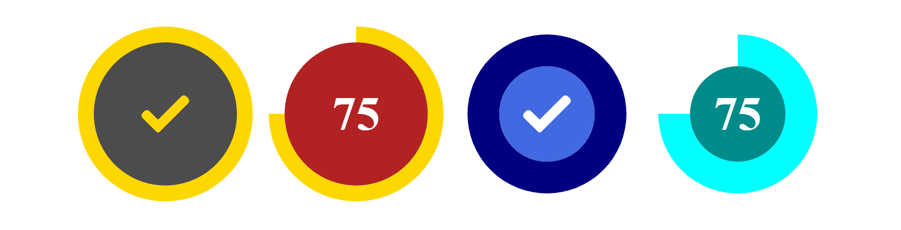

<a name="CircularProgressBar"></a>




[](https://github.com/AngeloFaella/CircularProgressBar/blob/master/LICENSE)
[](https://GitHub.com/AngeloFaella/CircularProgressBar/releases/)


# CircularProgressBar.js

A lightweight circular progress bar made with Js, SVG circles, and CSS transitions.

## How to use
Add these tags in yout HTML:

```html
<html>
  <head>
    <!-- Import CSS -->
    <link rel="stylesheet" href="https://cdn.jsdelivr.net/gh/AngeloFaella/CircularProgressBar@1.0/circularProgressBar.css">
  </head>
  <body>
    <!-- Add a container with class="cpb-progress-container" -->
    <div id="my-container" class="cpb-progress-container"><div>  
    <!-- Import Js -->    
    <script src="https://cdn.jsdelivr.net/gh/AngeloFaella/CircularProgressBar@1.0/circularProgressBar.min.js"></script>
  </body>
</html>
```

Then initialize the circular progress bar, for example:
```js
    let myProgressBar = new CircularProgressBar(360, 360, 'my-container', {
            strokeSize: 30,
            backgroundColor: 'rgba(0,0,0,.35)',
            strokeColor: '#ff3333',
            showProgressNumber: false,
            centerIcon: 'img/done_icon_yellow.svg',
            oncomplete: () => console.log('Task completed!')
    });
```
See a **live example [here](https://htmlpreview.github.io/?https://github.com/AngeloFaella/CircularProgressBar/master/example.html).**
  

## Documentation  

Methods
* [new CircularProgressBar(width, height, container, [options])](#new_CircularProgressBar_new)
* [.setBackgroundColor(color)](#CircularProgressBar+setBackgroundColor)
* [.setStrokeColor(color)](#CircularProgressBar+setStrokeColor)
* [.showProgressNumber(enabled)](#CircularProgressBar+showProgressNumber)
* [.setCenterIcon(src)](#CircularProgressBar+setCenterIcon)
* [.setProgress(percent)](#CircularProgressBar+setProgress)
* [.getProgress()](#CircularProgressBar+getProgress) ⇒ <code>Number</code>

<a name="new_CircularProgressBar_new"></a>

### new CircularProgressBar(width, height, container, [options])
**Kind**: constructor of [<code>CircularProgressBar</code>](#CircularProgressBar)  

| Param | Type | Default | Description |
| --- | --- | --- | --- |
| width | <code>Number</code> |  | width in px |
| height | <code>Number</code> |  | height in px |
| container | <code>String</code> |  | ID of the parent |
| [options] | <code>Object</code> |  | progress bar options |
| [options.strokeSize] | <code>Number</code> | <code>1</code> | size of the stroke |
| [options.backgroundColor] | <code>String</code> | <code>&#x27;black&#x27;</code> | background color of the inner circle |
| [options.strokeColor] | <code>String</code> | <code>&#x27;white&#x27;</code> | color of the stroke |
| [options.centerIcon] | <code>String</code> |  | icon displayed at the center of the inner circle |
| [options.showProgressNumber] | <code>Boolean</code> | <code>false</code> | icon displayed at the center of the inner circle |
| [options.oncomplete] | <code>EventListener</code> |  | callback function invoked when progress reach 100% |

<a name="CircularProgressBar+setBackgroundColor"></a>

### circularProgressBar.setBackgroundColor(color)
set color of the inner circle

**Kind**: instance method of [<code>CircularProgressBar</code>](#CircularProgressBar)  

| Param | Type | Description |
| --- | --- | --- |
| color | <code>String</code> | a valid CSS color |

<a name="CircularProgressBar+setStrokeColor"></a>

### circularProgressBar.setStrokeColor(color)
set color of the stroke

**Kind**: instance method of [<code>CircularProgressBar</code>](#CircularProgressBar)  

| Param | Type | Description |
| --- | --- | --- |
| color | <code>String</code> | a valid CSS color |

<a name="CircularProgressBar+showProgressNumber"></a>

### circularProgressBar.showProgressNumber(enabled)
**Kind**: instance method of [<code>CircularProgressBar</code>](#CircularProgressBar)  

| Param | Type | Description |
| --- | --- | --- |
| enabled | <code>Boolean</code> | boolean to show/hide progress number |

<a name="CircularProgressBar+setCenterIcon"></a>

### circularProgressBar.setCenterIcon(src)
set an image at the center of the progressbar

**Kind**: instance method of [<code>CircularProgressBar</code>](#CircularProgressBar)  

| Param | Type | Description |
| --- | --- | --- |
| src | <code>String</code> | image src |

<a name="CircularProgressBar+setProgress"></a>

### circularProgressBar.setProgress(percent)
Set progress of the progressbar (with animation);

**Kind**: instance method of [<code>CircularProgressBar</code>](#CircularProgressBar)  

| Param | Type | Description |
| --- | --- | --- |
| percent | <code>Number</code> | progress percentage |

<a name="CircularProgressBar+getProgress"></a>

### circularProgressBar.getProgress() ⇒ <code>Number</code>
Get current progress

**Kind**: instance method of [<code>CircularProgressBar</code>](#CircularProgressBar)  
